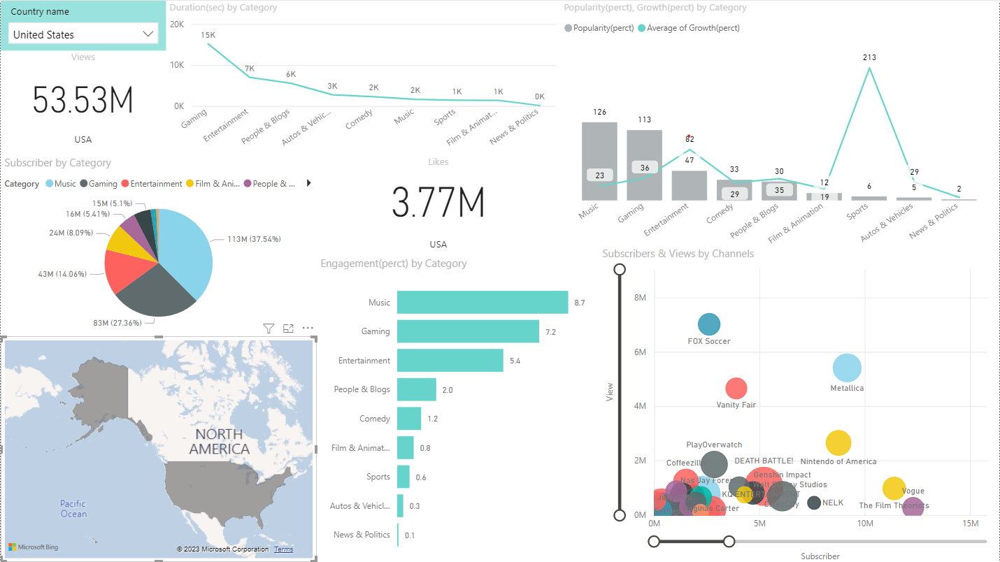

# ELEVATELABS_Final_Project

# YouTube Trending Video Analytics
- This project analyzes YouTube trending video data from multiple countries to uncover insights on popular genres, sentiment in titles/tags, and regional viewing patterns. It uses Python, Power BI, and JSON-based category mapping for a complete analytics pipeline.
- Developed as part of an internship project focused on dashboard building and data storytelling.

# Key Features
# Dashboard Insights
- Most Popular Categories (Genres) by Views
- Sentiment Distribution in Video Titles
- Region-wise Comparison of Category Performance

# Sentiment Analysis
- Performed on video titles using `TextBlob`
- Classified into Positive / Neutral / Negative

# Technologies Used
- Python: pandas, TextBlob, matplotlib (for preprocessing and sentiment)
- Power BI: Data visualization & dashboard creation
- JSON: For mapping category IDs

# Dashboard Preview

# How to Use
1. Clone or download this repository.
2. Open `youtube_data_postprocessed.csv` in Power BI or use the `.pbix` file directly.
3. Explore or modify the visuals in Power BI as needed.
4. Use `Youtube_EDA.ipynb` to understand how data was cleaned and sentiment was derived.

# Author
- Ankur Parmar — Data Analytics Intern  
- This project was part of my internship deliverables for hands-on dashboarding experience.

# Sources
- YouTube Trending Datasets: Publicly available from Kaggle or other sources
- Python Libraries: pandas, TextBlob, matplotlib

# License
- This project is for educational and academic purposes only.
